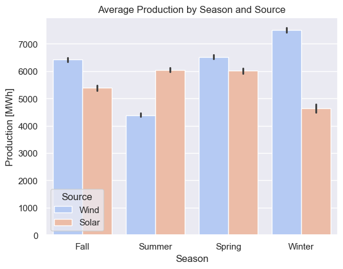
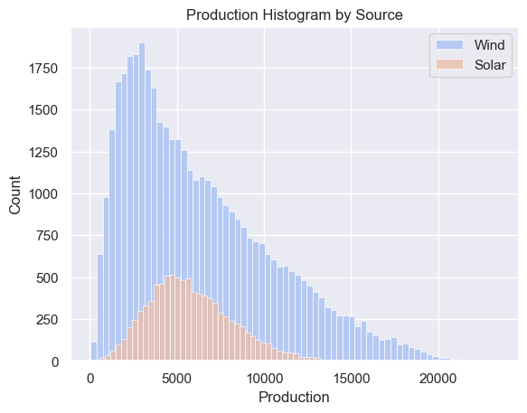
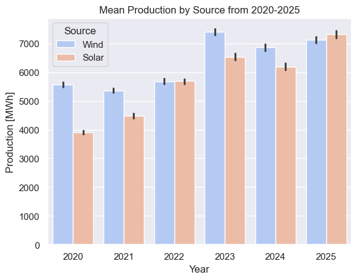

# France Renewable Energy Analysis


- [France Renewable Energy Analysis](#france-renewable-energy-analysis)
  - [📖 Overview](#-overview)
  - [📊 Data Sources](#-data-sources)
  - [📂 Repository Structure](#-repository-structure)
  - [🚀 Getting Started](#-getting-started)
    - [Installation](#installation)
  - [💡 Key Insights](#-key-insights)
    - [1. Source-Specific Production Characteristics](#1-source-specific-production-characteristics)
    - [2. Grid Stability Implications](#2-grid-stability-implications)
    - [3. 📈  Historical Production Trends (2020-2024)](#3---historical-production-trends-2020-2024)
  - [SQL](#sql)
  - [🛠️ Technologies](#️-technologies)
  - [👤 Authors](#-authors)

## 📖 Overview

This project analyzes renewable energy production trends in France, specifically focusing on **Wind** and **Solar** power.

Using production data from January 2020 to December 2025, the analysis explores seasonal patterns, the growth of renewable capacity over the last five years, and possible implication of the current mix of energies on grid stability. 


## 📊 Data Sources

The data used in this repository is the **Wind & Solar Energy Production Dataset** hosted on Kaggle, which is a processed extraction from official French energy network data.


*   **Repository:** [Wind and Solar Energy Production Dataset (Kaggle)](https://www.kaggle.com/datasets/ahmeduzaki/wind-and-solar-energy-production-dataset/data?select=Energy+Production+Dataset.csv)
*   **Original Source:** [Open Data Réseaux Énergies (ODRÉ)](https://opendata.reseaux-energies.fr/)
    *   *Dataset:* [Courbes de production mensuelles Éolien & Solaire](https://odre.opendatasoft.com/explore/dataset/courbes-de-production-mensuelles-eolien-solaire-complement-de-remuneration/analyze/?disjunctive.heure)

*   **Time Period:** January 2020 – November 2025
*   **Granularity:** Hourly measurements


## 📂 Repository Structure

```bash
france-renewable-energy-analysis/
├── Reports/
│   ├── eda_univariate.ipynb          # pdf report generated from notebook
│   ├── eda_bivariate.ipynb           # pdf report generated from notebook
│   └── presentation-france-renewable-energy-analysis.pdf # Final presentation on Ironhack
├── images/                           # Generated plots (Seasonality, Trends)
│   ├── 1_eda_univariate.ipynb        # Univariate analysis
│   ├── 2_data_cleaning.ipynb         # Handling timestamps, missing values, preprocessing
│   ├── 3_eda_bivariate.ipynb         # Bivariate and multivariate analysis
├── sql/                              # Files related to the sql queries
│   ├── queries.sql                  # SQL business queries based on multivariate analysis
│   ├── sql/csv_to_db.py              # Convert cleaned csv into db
├── requirements.txt                  # Python dependencies
└── README.md                         # Project documentation
```

## 🚀 Getting Started

Prerequisites: 

* Python 3.10 or higher

### Installation

1. Clone the repository

```bash
git clone https://github.com/coffeedrunkpanda/france-renewable-energy-analysis.git
cd france-renewable-energy-analysis
```

2. Install dependencies

```bash
pip install -r requirements.txt
```

3. Usage

The notebooks already download the data from Kaggle.

Launch the main analysis notebook to view the visualizations on vscode or by:

```bash
jupyter notebook eda-univariate.ipynb
```

> Note: Before executing the `eda-bivariate.ipynb`, execute the `data-cleaning.ipynb`, to obtain the cleaned and preprocessed csv file.

## 💡 Key Insights

This exploratory analysis reveals critical insights into renewable energy production patterns that
directly impact grid management strategies and investment decisions.

### 1. Source-Specific Production Characteristics

The analysis highlights distinct behaviors between wind and solar generation:

*   🌬️ **Wind Energy:**
    *   **Seasonality:** Exhibits strong seasonal variation with peak output during winter months and significant decline in summer.
    *   **Volatility:** High volatility characterized by frequent outliers and a right-skewed distribution.
    *   **Grid Impact:** Inherent unpredictability poses challenges for load forecasting and dispatch planning.
*   ☀️ **Solar Energy:**
    *   **Predictability:** Demonstrates near-Gaussian distribution with more predictable behavior.
    *   **Reliability:** Winter production decreases are moderate compared to wind’s seasonal swings. Lower outlier frequency suggests higher reliability for baseline capacity planning.

### 2. Grid Stability Implications

The current wind-to-solar generation mix presents stability concerns during periods where both sources experience simultaneous low production. Strategic pathways include:
*   **Short-term:** Integration of dispatchable sources (battery storage, gas/coal) to address intermittency gaps and meet demand surges.
*   **Medium-term:** Expansion of solar capacity to improve generation predictability and reduce portfolio variance, alongside exploration of alternative dispatchable sources like nuclear or hydroelectric.

### 3. 📈  Historical Production Trends (2020-2024)

Analysis reveals an oscillating growth pattern with an overall upward trajectory, indicating:
*   Successful capacity additions despite year-to-year fluctuations.
*   Potential influence of external factors such as grid constraints or weather anomalies.
*   A need for deeper investigation into the specific causes of annual deviations.

## SQL

To convert the csv file to db, run from the root directory:
```bash
python sql/csv_to_db.py
```

Open the db in your terminal:

```bash
sqlite3 renewable.db
```

Now you can run the queries stored in the `queries.sql` file one by one.

## 🛠️ Technologies
Pandas & NumPy: Data manipulation and cleaning.

Matplotlib & Seaborn: Static visualizations and statistical plots.

SQL (SQLite): specific queries

## 👤 Authors

Built by me (@coffeedrunkpanda) together with @suzanacracco-max for the Ironhack bootcamp of Data Science & Machine Learning.
